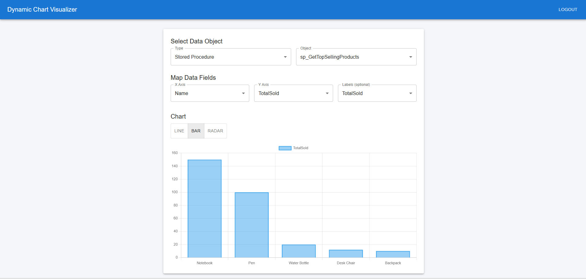

# Dynamic Chart Visualizer

A full-stack application for dynamically connecting to SQL Server databases, executing views/procedures/functions, and visualizing data with interactive charts.

## 📸 Demo



*The application interface showing a bar chart of top-selling products from the `sp_GetTopSellingProducts` stored procedure*

## 🚀 Quick Start

### Prerequisites
- .NET 8 SDK
- Node.js 18+ & npm
- SQL Server (LocalDB, Express, or full)

### 1. Backend Setup
```bash
cd backend/DynamicChartApp
dotnet build
dotnet ef database update
dotnet run
```
**API:** https://localhost:7185/swagger

### 2. Frontend Setup
```bash
cd frontend
npm install
npm start
```
**App:** http://localhost:3000

## ✨ Features

- **Dynamic SQL Server Connection** - Connect to any SQL Server database with user credentials
- **Database Object Execution** - List and execute views, stored procedures, and functions
- **Interactive Charts** - Visualize data with Line, Bar, and Radar charts (Chart.js)
- **JWT Authentication** - Secure login with auto-logout on session expiration
- **Material-UI Interface** - Modern, responsive React frontend
- **Real-time Data Mapping** - Dynamically map database columns to chart axes

## 📊 Sample Data

The application automatically creates demo data:

**Tables:**
- `Products` (10 sample products)
- `Sales` (15 sample sales records)

**Database Objects:**
- **View:** `vw_ProductSalesSummary` - Aggregated product sales data
- **Stored Procedure:** `sp_GetTopSellingProducts` - Top 5 selling products
- **Function:** `fn_GetProductStock(productId)` - Get stock for a specific product

## 🔧 Usage

1. **Login** with any username/password to get JWT token
2. **Connect** to your SQL Server database
3. **Select** a view, stored procedure, or function
4. **Map** data columns to chart axes
5. **Visualize** with interactive charts

## 🛠️ Development Commands

### Backend
```bash
# Build project
dotnet build

# Run migrations
dotnet ef database update

# Start API server
dotnet run

# Reset database
dotnet ef database drop
dotnet ef database update
```

### Frontend
```bash
# Install dependencies
npm install

# Start development server
npm start

# Build for production
npm run build
```

## 🔗 API Endpoints

- `POST /api/Auth/token` - User authentication
- `POST /api/Data/objects` - List database objects
- `POST /api/Data/execute` - Execute selected object

**Sample Request:**
```json
{
  "Host": "localhost",
  "Database": "DynamicChartDb", 
  "Username": "sa",
  "Password": "yourPassword",
  "ObjectName": "vw_ProductSalesSummary",
  "ObjectType": "View"
}
```

## 🧰 Tech Stack

**Backend:**
- .NET 8 Web API
- Entity Framework Core
- SQL Server
- JWT Authentication
- Swagger/OpenAPI

**Frontend:**
- React 18 + TypeScript
- Material-UI (MUI)
- Chart.js
- Axios for API calls

## 🐛 Troubleshooting

- **Database connection fails**: Check SQL Server is running and credentials are correct
- **Port conflicts**: Ensure ports 7185 (API) and 3000 (React) are available
- **Missing demo data**: Run `dotnet ef database update` to apply migrations

---

**Need help?** Open an issue on GitHub or check the Swagger documentation at `/swagger`